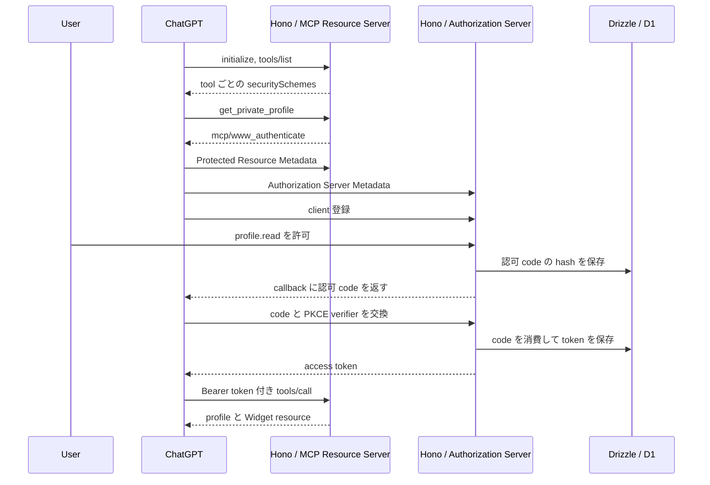

ChatGPT の Developer Mode から MCP tool を呼び、OAuth で接続したサービスのアカウント情報を取得して Widget に表示するアプリを実装しました。

今回の検証では、未接続の会話に接続カードと同意画面が表示され、認可後は元の tool が Bearer token 付きで再実行されました。
この記事の対象は OAuth protocol の解説ではなく、ChatGPT が保護された tool を見つけ、token に紐づくアカウントを取得し、その結果を会話と Widget へ返す実装です。
一連の動作を再現するため、Authorization Server と Resource Server を Hono で実装し、ChatGPT が送る request を Cloudflare Workers のログで確認しました。

実装は GitHub の [chatgpt-oauth-example](https://github.com/konojunya/chatgpt-oauth-example) で公開しています。
コード例は、動作確認に使った [515b6a0 時点の実装](https://github.com/konojunya/chatgpt-oauth-example/tree/515b6a0e4fb623bc76d24a4b00edde32bd03faaa) から説明に必要な行だけを抜粋しています。

:::message alert
この実装は ChatGPT との接続に必要な機能を確認するための検証用サーバーです。
OpenAI は、公開アプリでは[実績のある Identity Provider を使うことを強く推奨](https://developers.openai.com/plugins/build/auth#choosing-an-identity-provider)しています。
本番の Authorization Server としては使わないでください。
:::

## ChatGPT から認証済みプロフィールを取得する

`get_private_profile` を呼んだユーザーが未接続なら OAuth を開始し、接続後は token に紐づくプロフィールを返します。
実装した操作の流れは次のとおりです。

1. ChatGPT の tool menu から Developer Mode アプリを選ぶ。
2. 「現在接続しているアカウントのプロフィールを取得して」と依頼する。
3. ChatGPT が tool の認証要件を読み、接続カードを表示する。
4. Hono が返す同意画面で `profile.read` を許可する。
5. ChatGPT が callback を受け取り、認可 code を access token と交換する。
6. ChatGPT が元の tool を Bearer token 付きで再実行する。
7. tool の結果を ChatGPT 内の Widget に表示する。

ここで取得するのは、MCP server に接続したサービスアカウントです。
ChatGPT にログインしているユーザーの個人情報ではありません。


## ChatGPT と Hono アプリの責務

OAuth の役割名で整理すると、[ChatGPT は OAuth client](https://developers.openai.com/plugins/build/auth#components) です。
OpenID Connect の ID Token を扱っていないため、この記事の実装では ChatGPT を RP とは呼びません。

Hono アプリは、次の 2 つを同じ origin で提供します。

- **Authorization Server**：client 登録、同意画面、認可 code、access token を提供する。
- **Resource Server**：`/mcp` を公開し、Bearer token と scope を検証して tool を実行する。

ログイン認証も別の責務です。
このサンプルは `demo-user` がログイン済みだと仮定し、ユーザー認証を実装していません。
実サービスでは、同意画面を開く前にログイン session を検証し、認可するユーザーを確定させる必要があります。



## 使用した技術

- **Runtime と package manager**：Bun
- **HTTP framework**：Hono
- **MCP transport**：Streamable HTTP
- **OAuth**：Authorization Code、PKCE S256、Dynamic Client Registration
- **Database**：ローカルでは SQLite、Cloudflare Workers では D1
- **Query builder**：Drizzle ORM
- **Deployment**：Cloudflare Workers
- **ChatGPT UI**：MCP Apps の inline Widget

ローカルと D1 で repository interface を共有し、保存先だけを差し替えました。
OAuth の service 層は Cloudflare Workers の API に依存していないため、Bun の `app.fetch` だけで E2E test を実行できます。

## ChatGPT に認可 endpoint を知らせる

ChatGPT は、最初から認可 endpoint の場所を知っているわけではありません。
MCP server の **Protected Resource Metadata** を読み、そこから **Authorization Server Metadata** を取得します。

Hono では Protected Resource Metadata の origin 版と path 版、Authorization Server Metadata を次のように返しました。
[MCP Authorization 仕様](https://modelcontextprotocol.io/specification/2025-11-25/basic/authorization#protected-resource-metadata-discovery)では、Resource Server が path を持つ場合の path-aware discovery も定義されています。

```ts:src/oauth/routes.ts
const protectedResourceMetadata = {
  resource,
  authorization_servers: [issuer],
  scopes_supported: [...SUPPORTED_SCOPES],
  bearer_methods_supported: ["header"],
};

app.get("/.well-known/oauth-protected-resource", (c) =>
  c.json(protectedResourceMetadata),
);

app.get("/.well-known/oauth-protected-resource/mcp", (c) =>
  c.json(protectedResourceMetadata),
);

app.get("/.well-known/oauth-authorization-server", (c) =>
  c.json({
    issuer,
    authorization_endpoint: `${issuer}/oauth/authorize`,
    token_endpoint: `${issuer}/oauth/token`,
    registration_endpoint: `${issuer}/oauth/register`,
    scopes_supported: [...SUPPORTED_SCOPES],
    response_types_supported: ["code"],
    grant_types_supported: ["authorization_code", "refresh_token"],
    token_endpoint_auth_methods_supported: ["none"],
    code_challenge_methods_supported: ["S256"],
  }),
);
```

この例では、ChatGPT が接続ごとに public client を登録できるように [Dynamic Client Registration（DCR）](https://datatracker.ietf.org/doc/html/rfc7591) を実装しています。
DCR の request で受け取った redirect URI を保存し、[authorize endpoint と token endpoint の両方で完全一致](https://modelcontextprotocol.io/specification/2025-11-25/basic/authorization#redirect-uri-validation)を要求します。

現在の OpenAI ドキュメントは、Authorization Server が対応できる場合には [Client ID Metadata Documents（CIMD）を推奨](https://developers.openai.com/plugins/build/auth#client-registration)しています。
今回の Worker は DCR の registration endpoint を公開し、ChatGPT が送る client 登録 request を受け付ける構成にしました。

ChatGPT が使う metadata と OAuth flow は、OpenAI の [Authentication](https://developers.openai.com/plugins/build/auth) にまとまっています。

## tool ごとに認証要件を宣言する

MCP server 全体を OAuth 必須にすると、接続前の `tools/list` まで認証で止まります。
公開 tool と保護 tool を並べるため、ChatGPT のアプリ作成時には **Mixed Authentication** を選びました。

[ChatGPT Developer mode](https://developers.openai.com/api/docs/guides/developer-mode) では、Mixed Authentication の `initialize` と `tools/list` は未認証で実行されます。
各 tool の認証要否は、tool descriptor の `securitySchemes` で決まります。

```ts:src/mcp/server.ts
const publicSecuritySchemes: OpenAIToolDescriptor["securitySchemes"] = [
  { type: "noauth" },
];
const profileSecuritySchemes: OpenAIToolDescriptor["securitySchemes"] = [
  { type: "oauth2", scopes: ["profile.read"] },
];

const tools = [
  {
    name: "get_public_server_info",
    securitySchemes: [...publicSecuritySchemes],
    _meta: { securitySchemes: [...publicSecuritySchemes] },
  },
  {
    name: "get_private_profile",
    securitySchemes: [...profileSecuritySchemes],
    _meta: {
      securitySchemes: [...profileSecuritySchemes],
      ui: { resourceUri: "ui://profile/profile-v1.html" },
    },
  },
];

server.setRequestHandler("tools/list", async () => {
  return { tools } as never;
});
```

この実装で使った `@modelcontextprotocol/server@2.0.0` の core schema には、OpenAI 拡張の top-level `securitySchemes` が含まれていませんでした。
ChatGPT へ送る wire 上に field を残すため、`tools/list` の境界だけを low-level handler で返しています。
E2E test では、生の response と汎用 MCP client で parse した結果を分けて検査しました。

tool descriptor の宣言だけでは、access token の期限切れや必要な scope を満たさない状態を伝えられません。
保護 tool の handler では Bearer token を検証し、実行できない場合に `_meta["mcp/www_authenticate"]` を返します。

```ts:src/mcp/server.ts
function authenticationRequired(config: AppConfig, description: string) {
  const challenge =
    `Bearer resource_metadata="${config.resource}/.well-known/oauth-protected-resource", ` +
    `error="invalid_token", error_description="${description}"`;

  return {
    content: [{ type: "text", text: `認証が必要です: ${description}` }],
    _meta: { "mcp/www_authenticate": [challenge] },
    isError: true,
  };
}
```

OpenAI の認証ドキュメントでも、tool 単位の OAuth UI には metadata と runtime challenge の両方が必要だと説明されています。
server が HTTP 401 を返す通常の Resource Server と、JSON-RPC の tool result で challenge を返す MCP tool を混同しないようにしました。

## access token とアカウントを結び付ける

`get_private_profile` が返すアカウントは tool の引数ではなく、access token に保存した user ID から決まります。
authorize endpoint で同意したユーザーを認可 code に保存し、token endpoint で同じ user ID を access token へ引き継ぎます。

```ts:src/oauth/service.ts
const rawCode = createOpaqueToken("code");
const now = this.now();

await this.repository.saveAuthorizationCode({
  codeHash: await hashSecret(rawCode),
  clientId: view.client.clientId,
  userId: user.id,
  redirectUri: request.redirect_uri,
  scope: view.scopes.join(" "),
  resource: request.resource,
  codeChallenge: request.code_challenge,
  expiresAt: now + this.config.authorizationCodeTtlSeconds * 1000,
  consumedAt: null,
});
```

MCP request を受け取ると、Bearer token の hash で token record を検索します。
期限、失効状態、利用先の `resource` を検証した後、record の user ID からアカウントを取得します。

```ts:src/oauth/service.ts
async authenticateAccessToken(rawToken: string): Promise<AccessIdentity | null> {
  const record = await this.repository.getAccessToken(
    await hashSecret(rawToken),
  );
  const now = this.now();

  if (
    !record ||
    record.revokedAt !== null ||
    record.expiresAt <= now ||
    record.resource !== this.config.resource
  ) {
    return null;
  }

  const user = await this.repository.getUser(record.userId);
  if (!user) return null;

  return {
    token: rawToken,
    clientId: record.clientId,
    user,
    scopes: record.scope.split(" "),
    expiresAt: record.expiresAt,
    resource: record.resource,
  };
}
```

ChatGPT から `get_private_profile` へ user ID を渡さなくても、Bearer token だけで接続中のアカウントを特定できます。

## token に紐づくプロフィールを Widget に渡す

`get_private_profile` は、このアプリで認証済みの情報を取得する処理です。
`/mcp` が受け取った Bearer token を database で検証し、検証済みの `AuthInfo` だけを MCP handler へ渡します。

```ts:src/app.ts
const authInfo = await authenticateRequest(c.req.raw, oauth);

const response = await mcp.fetch(incomingRequest, {
  ...(authInfo ? { authInfo } : {}),
  parsedBody,
});
```

tool handler は `profile.read` scope を確認し、`AuthInfo` の user ID でアカウントを取得します。
prompt や tool の引数に user ID を含めないため、tool input から別のアカウントは指定できません。
ChatGPT の返答に使う `content` と Widget に渡す `structuredContent` は、同じ検証済みユーザーから組み立てます。
Widget に access token を渡さない構成です。

```ts:src/mcp/server.ts
async function getPrivateProfile(
  service: OAuthService,
  config: AppConfig,
  context: ServerContext,
) {
  const authInfo = context.http?.authInfo;
  const authError = checkProfileAuthorization(authInfo);
  if (authError) return authenticationRequired(config, authError);

  const userId = authInfo?.extra?.userId;
  if (typeof userId !== "string") {
    return authenticationRequired(config, "token に user identity がありません。");
  }
  const user = await service.getUser(userId);
  if (!user) {
    return authenticationRequired(config, "token の user が存在しません。");
  }

  return {
    content: [
      {
        type: "text",
        text: `${user.displayName} (${user.email}) のプロフィールです。`,
      },
    ],
    structuredContent: {
      profile: {
        id: user.id,
        displayName: user.displayName,
        email: user.email,
      },
      scope: "profile.read",
    },
  };
}
```

取得結果を ChatGPT 内で確認できるように、`get_private_profile` と `ui://profile/profile-v1.html` を関連付けました。

resource 側では MCP Apps の MIME type、Widget の origin、CSP を宣言します。
外部 API と外部 asset を使わない Widget なので、許可する domain は空配列です。

```ts:src/mcp/server.ts
{
  uri: "ui://profile/profile-v1.html",
  mimeType: "text/html;profile=mcp-app",
  text: PROFILE_WIDGET_HTML,
  _meta: {
    ui: {
      prefersBorder: true,
      domain: new URL(config.resource).origin,
      csp: {
        connectDomains: [],
        resourceDomains: [],
      },
    },
    "openai/widgetDomain": new URL(config.resource).origin,
  },
}
```

MCP Apps UI の resource URI、`structuredContent`、CSP は、OpenAI の [Add UI to your MCP server](https://developers.openai.com/plugins/build/chatgpt-ui) を参照しました。
公式ドキュメントにある `_meta.ui.domain` を設定し、今回確認した ChatGPT host との互換用に `openai/widgetDomain` にも同じ値を返しています。

## Cloudflare Workers へ deploy する

D1 migration を適用してから Worker を deploy します。

```sh
bun install --frozen-lockfile
bun run db:check
bun run db:migrate:remote
bun run deploy
BASE_URL=https://chatgpt-oauth-example.0xjj.workers.dev bun run smoke:deployment
```

ChatGPT から接続する MCP URL は、deploy した Worker の `/mcp` です。
今回使った URL は次の値でした。

```text
https://chatgpt-oauth-example.0xjj.workers.dev/mcp
```

ChatGPT Web では Developer Mode を有効にし、Plugins の作成画面から MCP URL を登録します。
認証方式には `OAuth` ではなく `Mixed Authentication` を指定します。

作成直後の詳細画面で「サポートされている認証」が「なし、OAuth」となり、次の 2 つの action が見えれば discovery まで進んでいます。

- `get_public_server_info`
- `get_private_profile`


## 注意点と詰まった点

ChatGPT へのアプリ登録からプロフィールの Widget 表示までに、tool discovery、OAuth callback、会話への tool 追加という別々の場所で処理が止まりました。
Worker の request log と ChatGPT の画面を対応させ、どの処理まで進んだかを切り分けました。

画面の error 文だけでは、ChatGPT と Worker のどちらで処理が止まったのかを判断できません。
そこで、各症状を `wrangler tail` に届いた request と対応させました。

| 症状 | Worker の tail | 調べる場所 |
| --- | --- | --- |
| action が一件もない | `tools/list` がない | 作成時 probe、認証方式、MCP handshake |
| action は見えるが会話で呼べない | 新しい request がない | 会話への app 追加、選択中のモデル、ChatGPT 側の状態 |
| OAuth の接続カードが出ない | 未認証 `tools/call` がある | `securitySchemes`、Protected Resource Metadata、`mcp/www_authenticate` |
| 同意後に戻らない | authorize POST はあるが token POST がない | redirect URI、同意画面の CSP |
| profile は返るが Widget が出ない | `tools/call` はあるが `resources/read` がない | resource URI、MIME type、Widget metadata |

診断ログには JSON-RPC method、Content-Type、認証済みかどうか、response status だけを残しました。
Authorization header、OAuth code、token、tool argument、profile は記録していません。

### action が一件も表示されなかった

最初のアプリでは認証方式に `OAuth` を指定していました。
この設定では、接続前の詳細画面に action が表示されず、ChatGPT はアプリ全体の接続を先に要求しました。

✅ **対応：Mixed Authentication に切り替える**

接続前でも `get_public_server_info` を使い、プロフィール取得時だけ認証を要求するため、認証方式を Mixed Authentication に変えました。
これにより、`initialize` と `tools/list` は匿名のまま、`get_private_profile` だけが `profile.read` を要求します。

しかし、Mixed Authentication に変えた直後にも action が表示されない場合がありました。
MCP client から直接 `tools/list` を呼ぶと 2 つの tool が返るため、OAuth の実装だけを直しても原因には届きません。

### 作成時の 0 byte POST が 415 になった

`wrangler tail` で作成時の request を追うと、ChatGPT は JSON-RPC handshake の前に次の POST を送っていました。

```text
POST /mcp
Content-Type: application/octet-stream
Accept: */*
Body: 0 bytes
```

この実装では、`@modelcontextprotocol/hono@2.0.0` と `@modelcontextprotocol/server@2.0.0` を組み合わせて使いました。
この request は JSON-RPC の処理へ入る前に、HTTP 415 が返りました。
その結果、ChatGPT が `initialize` と `tools/list` へ進まず、action が一件も表示されませんでした。

✅ **対応：空の到達確認だけ 204 で返す**

この POST は MCP の method ではなく、ChatGPT の作成画面による到達確認として観測したものです。
`application/octet-stream` かつ body が空の場合だけ 204 を返し、それ以外は MCP handler へ渡しました。

```ts:src/app.ts
async function readConnectivityProbeBodyByteLength(
  request: Request,
  parsedBody: unknown,
): Promise<number | null> {
  if (parsedBody !== undefined) return null;

  const contentType = request.headers
    .get("content-type")
    ?.split(";", 1)[0]
    ?.trim()
    .toLowerCase();

  if (
    request.method !== "POST" ||
    contentType !== "application/octet-stream"
  ) {
    return null;
  }

  return (await request.clone().arrayBuffer()).byteLength;
}

const probeBodyByteLength = await readConnectivityProbeBodyByteLength(
  incomingRequest,
  parsedBody,
);

if (probeBodyByteLength === 0) {
  return new Response(null, { status: 204 });
}
```

対応後の `wrangler tail` には、次のような順序で request が表示されました。

```text
4:26:27 POST /mcp tools/list -> 200
4:26:26 POST /mcp application/octet-stream body=0 -> 204
4:26:26 POST /mcp initialize -> 200
4:26:26 POST /mcp notifications/initialized -> 202
4:26:27 POST /mcp resources/read -> 200
```

`wrangler tail` の表示順は request の時刻順とは限りません。
実際の出力では `tools/list` が `initialize` より上に表示されましたが、timestamp は `initialize` のほうが 1 秒早い値でした。
[MCP の lifecycle](https://modelcontextprotocol.io/specification/2025-11-25/basic/lifecycle#initialization) でも、client は `initialize` request を送り、成功後に `notifications/initialized` を送るよう定められています。
したがって、表示順だけでは `tools/list` のほうが先に送信されたとは判断できません。
同一秒に記録された複数 request の厳密な前後関係は、このログだけでは断定していません。

ここで 204 が返ることだけでは、tool discovery の成功を保証しません。
後続の `initialize` と `tools/list` まで確認する必要があります。


### 同意後に ChatGPT へ戻らなかった

次に止まったのは OAuth の同意後です。
同意画面は表示され、許可ボタンの POST も Worker に届きましたが、ChatGPT の callback へ遷移しませんでした。

原因は、同意画面へ設定した HTTP CSP の `form-action` でした。
`form-action 'self'` だけでは、POST 後に続く ChatGPT origin への navigation が止まりました。

✅ **対応：登録済み callback origin を CSP に追加する**

callback origin をそのまま許可すると open redirect の入口になります。
先に DCR で登録した redirect URI と完全一致することを検証し、その後で origin だけを CSP へ追加しました。

```ts:src/oauth/routes.ts
const request = readAuthorizationRequest(
  new URL(c.req.url).searchParams,
);

// prepareAuthorization 内で client と redirect_uri の完全一致を検証する。
const view = await service.prepareAuthorization(request);
const callbackOrigin = new URL(request.redirect_uri).origin;

c.header(
  "Content-Security-Policy",
  `default-src 'none'; style-src 'unsafe-inline'; ` +
    `form-action 'self' ${callbackOrigin}; frame-ancestors 'none'`,
);

return c.html(renderConsentPage(request, view));
```

修正後は authorize POST の 302 に続いて token endpoint が呼ばれ、元の `get_private_profile` まで自動実行されました。


### app を選んでも会話から tool が呼ばれなかった

action が詳細画面に見えても、会話から tool を呼べるとは限りませんでした。
2026-08-02 の検証では、入力欄にアプリの chip がある状態でも、`Pro` を選んだ会話は「tool が利用可能な一覧へ公開されていない」と返しました。

このとき Worker には `initialize` と `tools/call` のどちらも届いていません。
したがって、OAuth route や MCP handler が返した error ではありません。


✅ **対応：通常モードへ切り替える**

同じアプリと prompt のまま `Pro` を外して通常モードへ切り替えると、`tools/call` が Worker へ届き、HTTP 200 で成功しました。
これは 2026-08-02 に使用した ChatGPT Web の製品挙動であり、MCP protocol の仕様ではありません。

### Widget domain の警告が出た

OAuth と profile tool が動いた後、アプリ詳細に「Widget domain がこの template に設定されていない」という警告が残りました。

✅ **対応：Widget resource に domain と CSP を設定する**

Widget resource の `_meta.ui.domain` に専用 Worker origin を設定し、今回確認した ChatGPT host との互換用に `openai/widgetDomain` にも同じ値を返すと警告が消えました。
外部通信をしない Widget では、`connectDomains` と `resourceDomains` を空配列にして CSP を明示しています。

Developer Mode の「CSP を適用する」設定も有効にしました。
Developer Mode でも CSP が有効な状態で確認し、未宣言の外部通信へ依存していないことを確かめるためです。


## 自動テストと実機テストの境界

E2E test は、Hono の `app.fetch` を直接呼び、次の流れを 1 つの test で実行します。

1. Protected Resource Metadata を取得する。
2. Authorization Server Metadata を取得する。
3. DCR で public client を登録する。
4. PKCE challenge を付けて認可 code を発行する。
5. code と verifier を token に交換する。
6. 未認証 tool が `mcp/www_authenticate` を返すことを確かめる。
7. Bearer token 付き tool が profile を返すことを確かめる。
8. Widget resource の origin と CSP を確かめる。

Unit test では PKCE、認可 code の 1 回限りの消費、`resource` の一致、refresh token rotation を検査します。
Integration test では、D1 で同じ code または refresh token を同時利用しても、一方だけが次の token pair を発行することを検査します。

一方、自動テストだけでは ChatGPT の app snapshot、会話への tool 追加、選択したモデル、iframe の描画を検査できません。
その部分は Developer Mode の手動操作と `wrangler tail` を同時に使って確認しました。

## 未接続の会話からプロフィール取得を再実行する

最後にアプリの接続を解除し、新しい会話から `get_private_profile` を依頼しました。

ChatGPT は接続カードを表示し、許可を選ぶと Hono の同意画面へ移動しました。
`profile.read` を許可すると callback 後に元の tool が自動実行され、profile Widget が表示されました。


最終的に、未接続の会話から OAuth を開始し、接続したアカウントの profile Widget を表示できました。
MCP server が正しい `tools/list` を返すことと、その tool が現在の会話へ渡されることは別の状態です。
ChatGPT との接続を調べるときは、MCP endpoint へ request が届く前なのか、届いた後なのかを分けると修正箇所を絞れます。

## 参考資料

- [ChatGPT Developer mode](https://developers.openai.com/api/docs/guides/developer-mode)
- [Authentication](https://developers.openai.com/plugins/build/auth)
- [Connect and test your plugin](https://developers.openai.com/plugins/deploy/connect-chatgpt)
- [Add UI to your MCP server](https://developers.openai.com/plugins/build/chatgpt-ui)
- [MCP Authorization](https://modelcontextprotocol.io/specification/2025-11-25/basic/authorization)
- [MCP Lifecycle](https://modelcontextprotocol.io/specification/2025-11-25/basic/lifecycle)
- [RFC 9728: OAuth 2.0 Protected Resource Metadata](https://datatracker.ietf.org/doc/html/rfc9728)
- [RFC 8414: OAuth 2.0 Authorization Server Metadata](https://datatracker.ietf.org/doc/html/rfc8414)
- [RFC 7591: OAuth 2.0 Dynamic Client Registration Protocol](https://datatracker.ietf.org/doc/html/rfc7591)
- [サンプル実装 chatgpt-oauth-example](https://github.com/konojunya/chatgpt-oauth-example)
